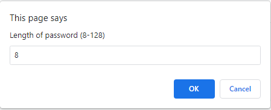
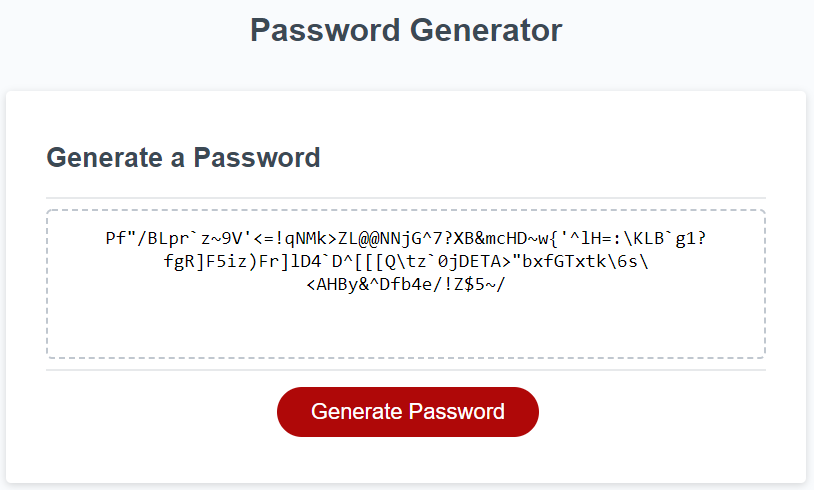

# Javascript Password Generator

## Description

This application enables users to generate random passwords based on the criteria that they've selected. This app will run in the browser and is powered by Javascript.

## Criteria Available

These are the criteria available to select when generating passwords:

- Number of characters - users can generate a minimum length of 8 and up to 128 characters
- Group of characters to use:
  - Lower case characters (abcdefghijklmnopqrstuvwxyz)
  - Upper case characters (ABCDEFGHIJKLMNOPQRSTUVWXYZ)
  - Numeric (1234567890)
  - Special Characters ( !"#$%&'()\*+,-./:;<=>?@[\]^\_`{|}~)

## How to Use

1. Click the 'Generate Password' button.
2. Enter a number for the password length. It would prompt you if the value you have entered is not within range of 8 to 128 or if it is a non-numeric value.

   

3. A window asking if you want to use the character groups will pop-up. Click <b>OK</b> if you want the group to be used and <b>Cancel</b> if you don't want to use that character group.
   
   <b>NOTE:</b> At least one character should be selected in order for the program to generate a password.
   
   
4. Do the previous step for the other character groups. Once eveything is selected, the generated password would show up on the textbox.
   

## Website

The following image shows the web application's appearance and functionality:

## Demo

Visit [this](https://alainatividad.github.io/Javascript-Password-Generator/) to see the webpage in action.
